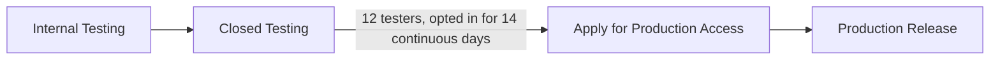
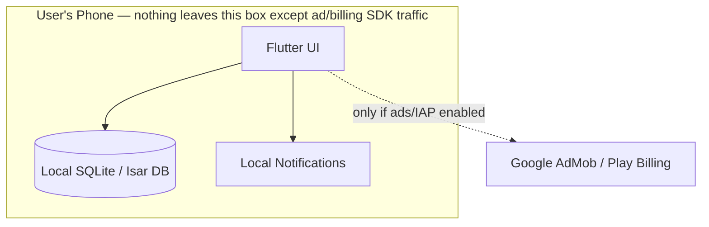

# Building & Launching Your Habit Tracker App — Complete Guide

*A from-scratch roadmap: coding, security, privacy/consent, and Play Store publishing for a free, open-source, local-first habit tracker.*

*Policy details (fees, testing rules, target API levels) are accurate as of July 2026 but Google changes these periodically — the Further Reading section links the official pages so you can double-check anything time-sensitive.*

---

## Table of Contents

1. [The 3 Decisions (and Why)](#1-the-3-decisions-and-why)
2. [Quick Roadmap](#2-quick-roadmap)
3. [Costs & Realistic Expectations](#3-costs--realistic-expectations)
4. [Environment Setup](#4-environment-setup)
5. [Project Architecture](#5-project-architecture)
6. [The Vibecoding Workflow with MiMo Code](#6-the-vibecoding-workflow-with-mimo-code)
7. [Build Order — Feature by Feature](#7-build-order--feature-by-feature)
8. [Data Storage](#8-data-storage)
9. [Notifications](#9-notifications)
10. [UI/UX Best Practices](#10-uiux-best-practices)
11. [Performance & Discoverability](#11-performance--discoverability)
12. [Testing](#12-testing)
13. [Security Checklist](#13-security-checklist)
14. [Privacy Policy, Data Safety & Consent (Cookies/GDPR)](#14-privacy-policy-data-safety--consent-cookiesgdpr)
15. [Monetization Setup](#15-monetization-setup)
16. [Open Sourcing on GitHub](#16-open-sourcing-on-github)
17. [Build & Sign the Release](#17-build--sign-the-release)
18. [Publishing on Google Play Console](#18-publishing-on-google-play-console)
19. [Post-Launch Maintenance](#19-post-launch-maintenance)
20. [FAQ / Common Pitfalls](#20-faq--common-pitfalls)
21. [Further Reading](#21-further-reading)

---

## 1. The 3 Decisions (and Why)

| Decision | Pick | Why |
|---|---|---|
| Stack | **Flutter (Dart)** | Cross-platform, but you'll ship Android-only for now. Fastest iteration loop (hot reload), huge ecosystem so AI coding tools write reliable code for it, Material Design 3 widgets built in. Actively developed by Google — #2 most popular mobile SDK across both app stores as of Google I/O 2026. |
| Monetization | **Ads (AdMob) + one-time "Remove Ads / Support" unlock** | Free users generate baseline ad revenue even with a tiny audience; engaged users can pay once for a clean experience. Nobody is forced to pay, and you never gate core habit-tracking behind a paywall — keeps faith with the "free and open source" spirit, same way Loop Habit Tracker and similar respected FOSS apps operate. |
| Coding tool | **MiMo Code** (your pick) | Real, MIT-licensed, actively maintained terminal coding agent from Xiaomi's AI team, built on the open-source OpenCode project. Works like Claude Code: describe features in plain English, it reads/writes files, runs commands, manages git. It's even built to be Claude Code-compatible. **Caveat**: its bundled free model access (MiMo-V2.5) is explicitly "for a limited time" — a promotion, not permanent. Use it to build your MVP for free, but don't assume it stays free forever (more in [Section 6](#6-the-vibecoding-workflow-with-mimo-code)). |

**Alternative you could have picked:** Kotlin + Jetpack Compose (Google's first-party native stack) — better if you specifically want to learn native Android, but a steeper setup for a first project.

**Alternative monetization paths:** pure ads (simplest, lowest ceiling), pure one-time IAP (higher revenue per payer, but you rely entirely on people choosing to pay), or donations only (simplest compliance, weakest revenue). The hybrid above is the standard, most successful pattern for small indie apps.

---

## 2. Quick Roadmap

- [ ] Pick an app name; check it isn't taken on Play Store, and pick a matching GitHub repo name
- [ ] Set up dev environment (Flutter SDK, Android Studio, MiMo Code, Git)
- [ ] Create the GitHub repo (license + `.gitignore`) — commit early, commit often
- [ ] Scaffold an empty Flutter app, confirm it runs on an emulator
- [ ] Build feature-by-feature (see [Section 7](#7-build-order--feature-by-feature))
- [ ] Write a privacy policy, host it free on GitHub Pages
- [ ] Set up AdMob account, ad units, and consent (UMP) messages
- [ ] Set up Play Billing for the one-time unlock
- [ ] Generate a signing keystore, configure the release build
- [ ] Create a Google Play developer account ($25), verify identity
- [ ] Fill out Play Console: store listing, content rating, data safety, ads declaration
- [ ] Internal testing → Closed testing (12 testers, 14 days) → apply for production access
- [ ] Publish, monitor, iterate



---

## 3. Costs & Realistic Expectations

- **$25 one-time, non-refundable** Google Play developer registration fee. This is the only unavoidable cost, and it covers unlimited future app publishes — no renewal, no per-app charge. "Completely free" isn't achievable once Play Store distribution is part of the plan, but it's a single small cost, not ongoing.
- Everything else — Flutter, Android Studio, MiMo Code's promo period, AdMob, GitHub, Play Billing setup — is free.
- **Play Store's commission only applies to money that flows through Play Billing** (i.e., your one-time unlock). It's currently 15% for a developer's first $1M/year in such revenue — which will cover you completely. Ad revenue and any external donation links aren't subject to any Play Store commission at all.
- **Market reality**: the habit tracker category on Play Store is crowded, including polished free options. Treat this primarily as a learning + portfolio project. Real income, if it comes, will likely be modest unless it gets genuine traction — that's normal and doesn't make it not worth doing.
- **Being in Pakistan**: AdMob operates there. Payouts go through wire transfer/EFT once you cross AdMob's payment threshold (currently around $100 USD). Set up and verify your payment profile as soon as you're eligible, rather than waiting until a payout is due — some Pakistan-based developers have reported payment-profile verification issues that took time to resolve through Google support.

---

## 4. Environment Setup

You do **not** need a Mac — that's only required for iOS/Xcode development, and you're Android-only for now. Any reasonably modern Windows, Mac, or Linux computer works.

1. Install the **Flutter SDK** (flutter.dev's install guide for your OS).
2. Install **Android Studio** — gives you the Android SDK, an emulator, and (via plugin) Flutter/Dart support.
3. Run `flutter doctor` in a terminal and resolve anything it flags (licenses, missing SDK components, etc.).
4. Install **MiMo Code**:
   - Mac/Linux: `curl -fsSL mimo.xiaomi.com/install | bash`
   - Windows: `npm install -g @mimo-ai/cli` (requires Node.js first)
   - On first launch it'll ask you to pick a model — choose the free MiMo-V2.5 to start.
5. Create a free **GitHub** account if you don't have one, and install **Git**.
6. A real Android phone for testing is nice to have (notifications and battery behavior are more realistic than on an emulator) but not required to get started.

---

## 5. Project Architecture

No backend. No server. No database you host or pay for. Everything lives in a local database file on the user's device. The only network calls your app makes are the ad SDK's own traffic and, later, Play Billing's — both go directly from the user's device to Google, and you never see or handle that data or traffic.



This architecture is also why your privacy story is simple: there's no server-side data collection to secure, disclose, or worry about losing.

---

## 6. The Vibecoding Workflow with MiMo Code

Open a terminal in your empty project folder and launch MiMo Code. It behaves like Claude Code: you describe what you want in plain English, it reads and writes files, runs commands, and can manage git for you.

**Rules that apply regardless of which AI tool you use:**

1. **One feature per prompt.** Don't ask for "the whole app." Ask for "the Habit data model and local storage layer," get it working, then move to the next thing.
2. **Test after every change.** Run the app (`flutter run`) before asking for the next feature. Problems are much easier to spot while the change is small.
3. **Commit after every working feature.** `git add -A && git commit -m "add habit data model"` — this is your undo button when an AI edit breaks something.
4. **Read the diffs**, even if you don't understand every line. Skim specifically for: new network calls you didn't ask for, new entries in `AndroidManifest.xml` (especially permissions), and any file writes outside the app's own storage. Ask the AI to explain anything unfamiliar before accepting it — this matters more for a public repo than a private hobby project.
5. **Keep a running spec file** (e.g. `PLAN.md`) listing features and their status, so the AI — and future you — has consistent context across sessions.

**On the "limited time free" part**: treat MiMo-V2.5 access as a great, zero-cost way to get your MVP built, not a permanent foundation. When the promo ends, you have three paths that all work fine because your code is just plain Dart/Flutter in a git repo, not locked into any tool: pay modest token costs to keep using MiMo Code, point the same tool at a different model backend (it supports several), or switch to a different AI assistant entirely — including just continuing here with me.

---

## 7. Build Order — Feature by Feature

Work through these in order — each step is a reasonable single prompt to your AI tool, and later steps depend on earlier ones being solid.

1. **Scaffold**: `flutter create habit_tracker`, run it on an emulator, confirm the default app works. Proves your environment is fine before adding complexity.
2. **Data layer**: `Habit` and `Completion` models, local DB read/write functions. Test: add a hardcoded habit, confirm it comes back out of the database.
3. **Home screen**: list of habits with a tap-to-complete for "today." Test: mark a few done, restart the app, confirm state persisted.
4. **Add/Edit habit screen**: form for name, icon, color, frequency (daily / specific days / X times per week). Test: add a real habit through the UI.
5. **Streaks**: current streak + best streak, calculated from completion history. Test this one by hand — manually create a few days of history and verify the math. Streak logic is the piece most worth double-checking, since it's easy for an AI edit to quietly break it later.
6. **History view**: per-habit grid of past completions (think GitHub's contribution graph).
7. **Stats screen**: overview across all habits.
8. **Notifications**: per-habit reminder at a chosen time, with proper runtime permission requests.
9. **Settings**: dark/light/system theme, manual export/import.
10. **Polish pass**: empty states (no habits yet), loading states, delete confirmations, undo on accidental completion.
11. **Ads integration + consent flow** ([Section 15](#15-monetization-setup)).
12. **One-time unlock (Play Billing)** ([Section 15](#15-monetization-setup)).
13. **Final QA pass on a real device**, then move to signing and publishing ([Sections 17–18](#17-build--sign-the-release)).

**Scope for v1 — resist adding more before shipping this:** add/edit/delete habits, daily check-off, streaks, one history view, reminders, dark mode, export/import, ads + one unlock. Everything else (widgets, categories, custom themes, optional cloud backup to the *user's own* Drive) is a good v1.1+ list.

---

## 8. Data Storage

- Use `sqflite` (SQL — most tutorials and AI training data reference it) or `Isar`/`Hive` (simpler API, fast). Either is fine; have your AI tool pick one and stay consistent throughout.
- A minimal schema: a `habits` table (id, name, icon, color, frequency, created_at) and a `completions` table (habit_id, date). Simple, and extensible later.
- **Manual export/import** (a JSON file, shared via Android's share sheet or saved locally) is the privacy-respecting way to let people back up or move their data between phones without you hosting anything. It's a real feature people ask for in local-first apps — don't skip it.

---

## 9. Notifications

- Use the `flutter_local_notifications` package.
- Android 13+ requires the `POST_NOTIFICATIONS` permission to be requested **at runtime** — declaring it in the manifest alone isn't enough.
- To survive device restarts, add `RECEIVE_BOOT_COMPLETED` and reschedule notifications on boot.
- Keep reminders to per-habit times the user picked — not aggressive re-engagement pings. Better UX, and keeps you clear of Play's spam-notification policies.

---

## 10. UI/UX Best Practices

- Material Design 3 (`useMaterial3: true` — Flutter's default) gives you a polished look with minimal custom design work.
- Support dark mode via `ThemeMode.system` — trivial to add in Flutter, expected by users.
- Keep onboarding to one or two screens; get people to "add your first habit" fast.
- Basic accessibility: sufficient color contrast, readable font sizes, don't rely on color alone to convey streak status (add an icon or label too).

---

## 11. Performance & Discoverability

"Optimizing" covers a few different things worth separating:

**Runtime performance**: Flutter's release builds are already AOT-compiled and fairly fast by default. Practical habits: use `const` constructors where possible, avoid rebuilding large widget trees unnecessarily, use `ListView.builder` (not building all list items up front) for anything that scrolls, and keep images as vectors or properly compressed/sized assets.

**App size**: matters more than usual for you, since Play distributes via Android App Bundles that already serve device-specific splits — but keeping dependencies and assets lean still helps first-time downloads convert, especially in bandwidth-conscious markets.

**Discoverability (ASO)**: an honest, keyword-relevant title and short description, a handful of clean screenshots, and actually responding to reviews all move the needle more than people expect for a free utility app with no marketing budget.

---

## 12. Testing

- Manual testing on an emulator, and ideally a real device before each release.
- `flutter test` for unit tests on your data logic — streak calculation is the best candidate: pure logic, easy to test, easy to silently break during an AI-driven refactor.
- Play Console's **Internal Testing** track is the fastest way to get a real, installable build onto your own phone via a shareable link — use it constantly during development, not just before launch.

---

## 13. Security Checklist

Even with no backend, these matter:

- **Never commit secrets** to the public repo: your upload keystore file and its passwords, any Play Console service-account JSON (if you ever automate publishing), and any API keys. Your AdMob App ID isn't really secret (it ships inside the compiled app anyway), but treat everything else as if it is.
- Store signing credentials in a `key.properties` file, referenced from `android/app/build.gradle` — and make sure `key.properties`, `*.jks`, `*.keystore`, and `.env` are all in `.gitignore` from day one.
- Enable code shrinking/obfuscation on release builds (`flutter build appbundle --obfuscate --split-debug-info=<dir>`) — shrinks app size and makes casual decompilation harder.
- **Minimize permissions.** A local habit tracker realistically needs only `POST_NOTIFICATIONS` and `RECEIVE_BOOT_COMPLETED`. Definitely not contacts, location, camera, or broad storage access. Unnecessary permissions hurt user trust and invite extra Play review scrutiny.
- Stick to well-maintained pub.dev packages (check likes/pub points), and enable **GitHub Dependabot alerts** (free, one click in repo Settings → Security) for dependency vulnerability notifications — genuinely useful for an open-source repo.
- Since the AI writes most of the code, specifically audit: any file I/O (should only ever touch the app's own private storage, except the explicit export feature), any network calls (a local-first app should have close to zero besides ad/billing SDK traffic — if one shows up unexpectedly, ask why before accepting it), and the permissions list in `AndroidManifest.xml`.

---

## 14. Privacy Policy, Data Safety & Consent (Cookies/GDPR)

*I'm not a lawyer, and this isn't legal advice — but here's what actually applies mechanically for an app like this.*

**On "cookies" specifically**: a native mobile app doesn't use browser cookies. The direct equivalent is consent to use device identifiers (like the Android Advertising ID) for ad purposes — which is exactly what the consent flow below covers.

**You need a privacy policy even though you don't collect anything yourself.** Play Console requires a privacy policy URL for essentially all apps, because your ad SDK collects some data (advertising ID, device info, IP-derived approximate location) on your behalf even if you never touch it. Host it free: add `docs/privacy-policy.md` to your GitHub repo and enable GitHub Pages pointed at `/docs` — gives you a free public URL. Ask your AI tool to draft the text once you know exactly which SDKs you're using (AdMob, and Play Billing).

**Play Console's Data Safety section** is a separate, mandatory questionnaire (not just the policy text) declaring what data types are collected and why. Play Console has a built-in wizard that suggests entries based on the SDKs you declare — use it, and cross-check against AdMob's current "user data" documentation, since exactly what's collected can shift between SDK versions. Fill it out accurately; misrepresenting it is a policy violation.

**AdMob consent (UMP SDK)**: since January 16, 2024, anyone using AdMob to serve ads to EEA or UK users must use a Google-certified Consent Management Platform. Since Play Store distributes globally by default, this applies to you in practice. Implementation:
- Use the `google_mobile_ads` Flutter plugin — it bundles the UMP SDK, so no separate dependency needed.
- Create your GDPR/UK consent message in the AdMob console under **Privacy & messaging**.
- Call `requestConsentInfoUpdate()` then `loadAndShowConsentFormIfRequired()` at app launch.
- Add a "Privacy options" entry point somewhere in your settings menu so EEA/UK users can revisit or withdraw consent later — Google requires this be reachable at any time.
- AdMob's "US states" messaging (same Privacy & messaging console section) covers opt-out requirements from state-level US privacy laws — worth enabling alongside the GDPR one since it's essentially a toggle in the same tool.

**Content rating & audience**: fill out the IARC content rating questionnaire honestly (a habit tracker will almost certainly land on "Everyone"). Declare your app as **not primarily directed at children** — this is the correct call for a general productivity app, and it keeps you out of the stricter Play Families Policy requirements (which include a ban on personalized ads and extra COPPA-aligned rules).

---

## 15. Monetization Setup

**Ads**: use `google_mobile_ads`. Keep placements gentle — a banner on the home screen, maybe a native ad in a list — and avoid interstitials that interrupt the actual habit-checking moment. This is a wellness-adjacent app; heavy-handed ads there tend to tank reviews faster than in a game.

**One-time unlock**: use the `in_app_purchase` Flutter plugin against Google Play Billing. Frame it as "remove ads" and/or a couple of cosmetic extras (themes, a home screen widget) — not gating core habit-tracking, which would undercut the free/open-source positioning.

**Setup steps**:
1. Create ad units in the AdMob console once your Play Console app entry exists (they link together).
2. Set up a Play Billing product (one-time, non-consumable) in Play Console → Monetize → Products.
3. Test both with Google's official test ad unit IDs and Play Billing's test-purchase flow before going live — never test with your real ad units or real payments.

---

## 16. Open Sourcing on GitHub

**License**: for simplicity, **MIT** is a reasonable default (permissive, minimal ongoing obligations). If you like the "this must always stay open" philosophy, **GPLv3** (what Loop Habit Tracker uses) is the more copyleft-purist option — it doesn't stop you from also selling/monetizing your own official build, it just requires that source code for any distributed derivative stays available. GitHub lets you pick a license template when creating the repo.

**Repo structure**:
- `README.md` — what it does, screenshots, how to build it, license, and a plain note that the official Play Store build has ads + an optional unlock (transparency here builds trust with other FOSS-minded users).
- `LICENSE`
- `.gitignore` — critically exclude `key.properties`, `*.jks`, `*.keystore`, `.env`, build artifacts, and IDE folders.
- `CONTRIBUTING.md` (optional, nice once/if others want to help).

**Enable Dependabot alerts** (Settings → Security) — free vulnerability notifications for your dependencies.

A note some FOSS users care about: open-sourcing the code doesn't prevent you from also distributing your own compiled, monetized build on Play Store — this is completely standard practice, and it's exactly how many well-regarded FOSS Android apps operate (some also mirror an ad-free build to F-Droid separately, though F-Droid's policies exclude proprietary dependencies like AdMob/Play Billing entirely, so that's a v2+ consideration, not something to solve on day one).

---

## 17. Build & Sign the Release

1. Generate an upload keystore (only once, keep it safe — losing it is recoverable via Play App Signing, but annoying):
   ```bash
   keytool -genkey -v -keystore ~/upload-keystore.jks -keyalg RSA -keysize 2048 -validity 10000 -alias upload
   ```
2. Create `android/key.properties` (gitignored):
   ```
   storePassword=<your password>
   keyPassword=<your password>
   keyAlias=upload
   storeFile=/absolute/path/to/upload-keystore.jks
   ```
3. Reference it from `android/app/build.gradle` (standard Flutter documentation shows the exact snippet — ask your AI tool to wire this up, then verify it references `key.properties` and not hardcoded values).
4. Enroll in **Play App Signing** when you first upload — Google then manages your actual signing key, and can help you recover access if you ever lose your upload key.
5. Build the release bundle:
   ```bash
   flutter build appbundle --release --obfuscate --split-debug-info=build/debug-info
   ```
   Play Store requires the `.aab` format (App Bundle), not a raw APK, for new apps.

---

## 18. Publishing on Google Play Console

1. Create/sign in to a Google account, enable 2-Step Verification.
2. Go to Play Console, register a **personal developer account**, pay the $25 fee, and complete identity verification (government ID). Approval typically takes hours to a couple of days.
3. Create your app entry: name, default language, "App," "Free."
4. Complete every required section before your first release:
   - **Store listing**: short/long description, screenshots (multiple device sizes), feature graphic, icon, category (Health & Fitness or Productivity).
   - **App content**: privacy policy URL, ads declaration ("Yes, contains ads"), IARC content rating questionnaire, target audience (not primarily for children), Data safety section, and the various one-off declarations (government app, COVID tracing, news app — all "No" for you).
   - **App access**: "all functionality available without special access" (no login required here).
5. **Internal testing** first — add your own email, install via the generated link, confirm the real signed build works.
6. **Closed testing** next — this is mandatory for new personal accounts. Recruit at least 12 real testers (aim for 15–20, since dropping below 12 during the window risks resetting your count) via friends/family, relevant subreddits (r/androiddev, r/AlphaAndBetaUsers, r/androidapps), or indie-dev Discord communities. Avoid paid "tester farm" services — Google wants genuine engagement, and it's also just more useful feedback for you. Testers must stay opted in continuously for **14 days**.
7. Once eligible, apply for **production access** from the Play Console dashboard.
8. Create your production release. Consider a **staged rollout** (e.g. 20% → 50% → 100%) so early issues affect fewer users.
9. Check the **pre-launch report** (Google's automated device-farm testing) and **Android vitals** (crash rate, ANR rate) after release.

---

## 19. Post-Launch Maintenance

- Watch Android vitals in Play Console; fix crashes promptly.
- **Target API level requirements rise yearly.** As of now: new apps/updates must target Android 16 (API 36) by August 31, 2026 (extension to November 1 available if needed); existing apps need at least Android 15 (API 35) to stay visible to new users on newer devices. Building with the latest stable Flutter/Android Studio at any given time will generally keep you compliant automatically — just don't let the project sit unbuilt for years.
- Keep dependencies current (`flutter pub outdated`), respond to reviews, and triage GitHub issues as they come in.

---

## 20. FAQ / Common Pitfalls

**Can I skip the closed testing requirement?** No — for a new personal account, the "apply for production" button in Play Console stays locked until you meet it. It's enforced by the platform, not a suggestion.

**Do I really need a privacy policy if I collect zero data myself?** Yes — your ad SDK collects some data regardless, and Play Console requires the URL field for essentially all apps.

**What if MiMo Code's free period ends mid-project?** Nothing about your project is locked in. It's plain Dart/Flutter code in a git repo — switch model backends within the same tool, pay modest token costs, or move to a different AI assistant entirely.

**Will I make real money from this?** Maybe modestly, probably not a lot at first — the category is crowded. Treat it as a genuinely good learning and portfolio project first; revenue is a bonus on top.

---

## 21. Further Reading

- Flutter: https://flutter.dev
- MiMo Code (GitHub): https://github.com/XiaomiMiMo/MiMo-Code
- Loop Habit Tracker, for architectural inspiration (GPLv3, local-first): https://github.com/iSoron/uhabits
- Play Console Help — registration & fees: https://support.google.com/googleplay/android-developer/answer/6112435
- Play Console Help — closed testing requirements: https://support.google.com/googleplay/android-developer/answer/14151465
- Play Console Help — target API level requirements: https://support.google.com/googleplay/android-developer/answer/11926878
- Play Console Help — service fees: https://support.google.com/googleplay/android-developer/answer/112622
- AdMob — UMP SDK / GDPR setup: https://developers.google.com/admob/android/privacy/gdpr
- `google_mobile_ads` package: https://pub.dev/packages/google_mobile_ads
- `in_app_purchase` package: https://pub.dev/packages/in_app_purchase

---

*You've got a genuinely solid, well-scoped project here. Start at Section 4, work down in order, and resist adding features beyond the v1 scope in Section 7 until you've actually shipped once.*
